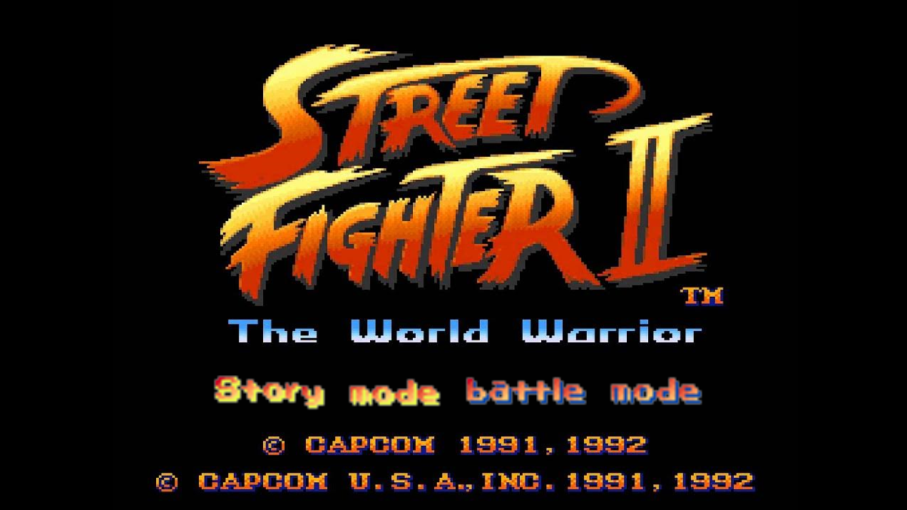
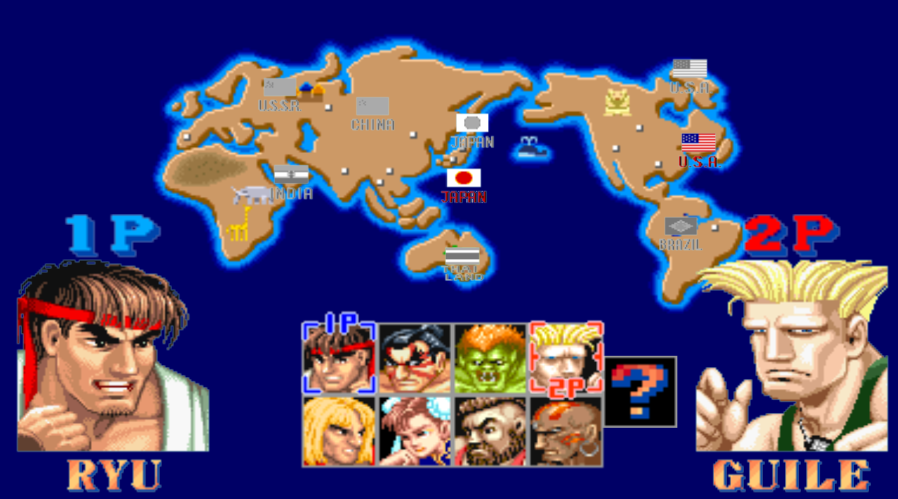
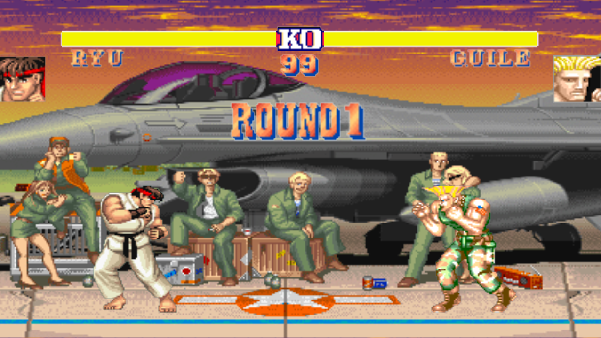
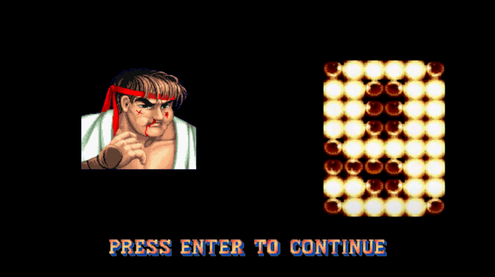
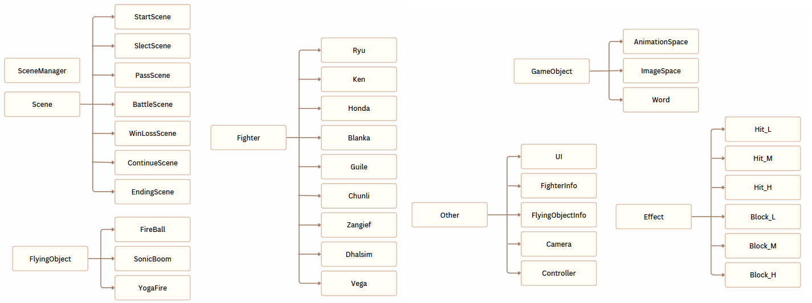

# 2025 OOPL Final Report

## 組別資訊

組別：9  
組員：112590030郭宇帆 112590029郭柏暘  
復刻遊戲：StreetFighter2

## 專案簡介

### 遊戲簡介
StreetFighter2是一款由 Capcom 開發的經典格鬥遊戲。遊戲的主要特色是讓玩家在世界各地的擂台上，操作不同國籍與風格的角色進行一對一格鬥，並根據玩家輸入的指令，施展各自獨特的招式與必殺技。這款遊戲不僅確立了格鬥遊戲的基本規則、操作模式與格鬥機制，也開創了玩家對格鬥遊戲的概念。
### 組別分工
112590030郭宇帆  
1.場景與角色機制的架構與邏輯撰寫  
2.角色特殊技能  
3.飛行物邏輯  
4.控制器的邏輯  
112590029郭柏暘  
1.角色通用動作的圖片抓取  
2.角色通用動作的補償與碰撞箱座標等設定  
3.UI血條介面撰寫
## 遊戲介紹

### 遊戲規則
#### 1.遊戲機制
這是一個1v1的格鬥遊戲，玩家可以選擇自己的角色與其他角色進行戰鬥。  
每個角色都有自己的招式，而相同的行為有左右移動、跳躍、蹲姿、格檔、輕中重拳頭與輕中重腳。   
不同的有拳腳攻擊的距離判定 還有獨自的絕招。  

每一場遊戲有三回合，血量歸零該回合就輸了，或是時間歸零血量較多者勝，先拿到兩回合者勝利。

根據不同的按鍵輸入，可以使用(輕中重)拳頭、(輕中重)腳攻擊、絕招。  
按住面對敵人的後退方向鍵可以進行格檔(不損失血量，如果是格檔絕招依舊會損失一些血量)。  
攻擊分為上段和中段和下段，上段攻擊只能站立格檔，下段攻擊只能蹲下格檔，中段則是站立或蹲下都可以格檔。  

角色站立時被打到會根據被打到部位有相應的回饋。  
在角色在空中被打到會倒地並起身，這段時間會有無敵。  

可以從敵人頭上跳過到另一邊，此時雙方角色會換邊，原本在左角色會換到右，又會換到左。  
只要角色在各自的角落鏡頭就不會移動，反之則會根據角色們的方向進行移動。 

左邊跟右邊人物有時需要輸入的指令會相反，比如:對左邊的角色來說按下⭠會是向後 對右邊的角色來說按下⭠會是向前。  

StoryMode中，會挑戰除了選擇角色外，輪流挑戰其他8隻由AI操控的角色，每次失敗後都可以選擇要不要接關繼續，不接關則GameOver，反之則繼續失敗的關卡，直到打敗所有其他角色。  
BattleMode中，可由兩個玩家控制各自的角色不斷互相戰鬥。 
#### 2.1P與2P按鍵
如果要兩人對戰建議再接上一支鍵盤 因為有些鍵盤無法同時輸入太多按鍵  

| 動作       | 1P 鍵位    | 2P 鍵位          |
|------------|------------|------------------|
| 向上       | W          | ↑（方向鍵）      |
| 向下       | S          | ↓（方向鍵）      |
| 向左       | A          | ←（方向鍵）      |
| 向右       | D          | →（方向鍵）      |
| 輕拳(LP)       | T          | 7（數字鍵盤）    |
| 中拳(MP)       | Y          | 8（數字鍵盤）    |
| 重拳(HP)       | U          | 9（數字鍵盤）    |
| 輕腳(LK)       | G          | 4（數字鍵盤）    |
| 中腳(MK)       | H          | 5（數字鍵盤）    |
| 重腳(HK)       | J          | 6（數字鍵盤）    |
| 確認       | ENTER ( 大鍵盤 )          | ENTER（數字鍵盤）    |  
#### 3.角色絕招(1P方向)和一般拳腳的下段
P=Punch K=Kick  
不管是輕中重都可以觸發招式  
但會根據按下的輕中重有不同的效果  
集氣技能的集氣時間取決於最後按下的輕中重攻擊  
輕=500ms 中=750ms 重=1000ms  

|角色|招式名稱|指令|特性|
|-|-|-|-|
|Ryu|波動拳|↓↘→＋P|發出波動|
||昇龍拳|→↘↓＋P|擊中會讓對手倒地|
||龍卷旋風腳|↓↙←＋K|可穿過波動|
|Ken|波動拳|↓↘→＋P|發出波動|
||昇龍拳|→↘↓＋P|擊中會讓對手倒地|
||龍卷旋風腳|↓↙←＋K|可穿過波動|
|E‧Honda|百裂手|同時按下任意兩顆P|
||頭槌|←(集氣)＋→＋P|
|Chunli|百裂腳|同時按下任意兩顆K|
||迴旋鶴腳踢|↓(集氣)＋↑＋K|可穿過波動|
|Blanka|放電|同時按下任意兩顆P|擊中會讓對手倒地|
||旋轉攻擊|←(集氣)＋→＋P|
|Guile|音速手刀|←(集氣)＋→＋P|發出波動|
||音速腳刀|↓(集氣)＋↑＋K|擊中會讓對手倒地|
|Zangief|金臂勾|同時按下任意兩顆P|可穿過波動 擊中會讓對手倒地 技能期間按住方向鍵可往前或後移動|
|Dhalsim|瑜珈之火|↓↘→＋P|發出波動|
||瑜珈火焰|同時按下任意兩顆P|擊中會讓對手倒地|
|Vega|剪刀腳|↓↘→＋K|
||精神力衝擊|←(集氣)＋→＋P|可穿過波動 擊中會讓對手倒地 技能期間可穿過敵人|
||影昇|↓(集氣)＋↑＋K|
||踩踏|K(在影昇期間)|上段攻擊|
||骷髏躍擊|P(影昇攻擊到對手返回期間)|上段攻擊|

跳躍攻擊皆為上段 無特別說明攻擊皆為中段  

|角色|下段攻擊招式|
|-|-|
|Ryu|蹲輕腳(CrouchLK)|
||蹲中腳(CrouchMK)|
|Ken|蹲輕腳(CrouchLK)|
||蹲中腳(CrouchMK)|
|E‧Honda|中腳(MK)|
||蹲重腳(CrouchHK)|
|Chunli|蹲輕腳(CrouchLK)|
||蹲中腳(CrouchMK)|
|Blanka|蹲輕腳(CrouchLK)|
||蹲中腳(CrouchMK)|
||蹲重腳(CrouchHK)|
|Guile|蹲輕腳(CrouchLK)|
||蹲中腳(CrouchMK)|
||蹲重腳(CrouchHK)|
|Zangief|蹲輕腳(CrouchLK)|
||蹲中腳(CrouchMK)|
||蹲重腳(CrouchHK)|
|Dhalsim|蹲輕腳(CrouchLK)|
||蹲中腳(CrouchMK)|
||蹲重腳(CrouchHK)|
|Vega|重腳(HK)|
||蹲輕腳(CrouchLK)|
||蹲中腳(CrouchMK)|
||蹲重腳(CrouchHK)|

#### 4.功能性按鍵
| 按鍵       | 功能          |
|------------|------------------|
| Tab       | 回到標題 (如果在戰鬥中則會回到選角畫面)      |
| Shift+I       | 開啟可視化Pushbox      |
| Shift+O       | 開啟可視化Hurtbox      |
| Shift+P       | 開啟可視化Hitbox      |
| Shift+9(大鍵盤的)       | 1P角色死亡    |
| Shift+0(大鍵盤的)       | 2P角色死亡    |
| L       | 回合計時直接結束    |
| K       | 在選角介面時開啟隱藏角色    |

### 遊戲畫面

## 程式設計

### 程式架構
在這次實習中，我將主要類別分成角色(Fighter)、場景(Scene)、效果(Effect)、
飛行物(FlyingObject)、圖像物件(GameObject)、其他(Other)。  
角色都繼承了Fighter、場景都繼承了Scene、效果都繼承了Effect、飛行物都繼承了FlyingObject、圖像物件都繼承了GameObject。  
在AppUpdate裡有SceneManager來管理目前的場景Init, Update, Render，再由目前的場景來呼叫該場景的物件的Init, Update, Render。

### 程式技術
#### 1.有限狀態機FSM
遊戲中角色需要根據玩家的輸入進行對應的狀態切換，所以我們使用 std::unordered_map 將每個狀態（FighterState）對應到其進入時執行的函式與每幀更新時執行的函式。  
每個角色的通用動作就綁定同一個Enter跟Update函式，而自己的特殊動作函式就只需要在自己的cpp中定義並綁定就好了，如果角色的共通動作有不同之處，也能在自己的cpp定義並綁定。
#### 2.圖片的補償調整和圖片的顯示時間
因為圖片顯示到遊戲中如果沒有補償(Offset)，會因為不同圖片有不同的長寬，導致角色在這個動作時顯示的很奇怪甚至是無法連貫，所以每個動作都需要一組Offset將目前的圖片顯示地相較流暢。  
因為PTSD的每張圖片顯示時間只能是一樣的，所以我們基於GameObject繼承了一個AnimationSpace來自定義每張圖片的時間、圖片的大小和自訂一些功能性的函式。  
#### 3.攝像頭Camera
攝像頭需要判斷兩隻角色的位置，來決定遊戲中的物件要被最終渲染的座標，並且目前最大的Camera座標，會由目前背景圖的長決定。
#### 4.碰撞箱Boxes
因為有Offset，所以所有行為的碰撞箱都要基於這個Offset再去獲得一個碰撞箱的相對座標和大小。  
Pushbox（推擠箱）：每個角色都具有自己的Pushbox，用來處理角色之間的空間碰撞與距離限制。而由於我們同時實作了 Camera 系統會跟隨角色移動，導致整體畫面的可見邊界也會根據角色位置而改變，因此角色在場景中的「實際可行動範圍」變成了一個動態邊界系統。  
Hurtbox（受擊框）：因為角色在不同狀態時Hurtbox都不同，所以需要自己設定座標和大小。  
Hitbox（攻擊框）：因為角色在不同狀態時Hitbox都不同，所以需要自己設定座標和大小。  
角色會在每一幀判斷自己是否受到攻擊或是是否被推擠，進而執行相對的行為或是切換狀態。
#### 5.控制器邏輯Controller
相對於其他遊戲，這個遊戲需要對輸入進行更多的邏輯判斷，會需要根據角色的方向去回傳往前往後，並且會需要儲存玩家輸入的指令和輸入的時間，來判斷是否能成功使用技能。  
基於這個狀態機與控制器，我在控制器中撰寫AI邏輯，讓他可以隨機執行一些操作。  

## 結語

### 問題與解決方法
較大的問題就是在剛剛程式技術的這幾個，剩下就是一些簡單的邏輯，在實作狀態機時遇到很大的問題，不斷的思考並打掉重新寫，最後才變成現在的模樣，而圖片的抓取、補償或碰撞箱等等設定，也是一個很繁瑣的工作，需要不斷微調才能達到想要的樣子，控制器也是寫了一段時間，因為可能的情況有很多，需要判斷到所有玩家的輸入情況，才不會導致錯誤等等。  
而這些就是慢慢地思考並解決，有時會去看看其他人是怎麼實作的，或是觀看一些影片等等。
### 自評

| 項次 | 項目                   | 完成 |
|------|------------------------|-------|
| 1    | 這是範例 |  V  |
| 2    | 完成專案權限改為 public |  V  |
| 3    | 具有 debug mode 的功能  |  V  |
| 4    | 解決專案上所有 Memory Leak 的問題  |  V  |
| 5    | 報告中沒有任何錯字，以及沒有任何一項遺漏  |  V  |
| 6    | 報告至少保持基本的美感，人類可讀  |  V  |

### 心得
這個專案應該是我們在大學中，撰寫最久也是持續最久的專案了，尤其在剛開始處理狀態機和圖片補償這些問題的時候，也是最累的時候了，有時候還會需要熬夜，不過在處理完這些底層架構的問題後，就能實作角色技能這些比較有趣的部分了，可以看到角色一步步完成，技能成功被實作出來，這心理的成就感是無法說出的。
### 貢獻比例
112590030郭宇帆 50%  
112590029郭柏暘 50%   